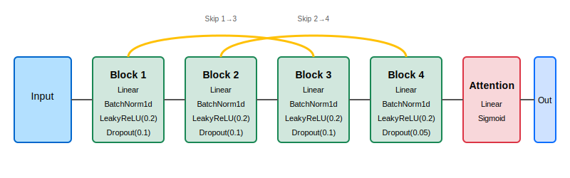

# RateMeAI
[](https://github.com/Pop101/RateMeAI/issues)

# Table of Contents
- [RateMeAI](#ratemeai)
- [Table of Contents](#table-of-contents)
- [Overview](#overview)
- [Technologies](#technologies)
- [Methodology](#methodology)
  - [Data Collection Methodology](#data-collection-methodology)
  - [Model Architecture](#model-architecture)
    - [Base Model Architectures](#base-model-architectures)
  - [Unified Classification Head](#unified-classification-head)
  - [Performance Comparison](#performance-comparison)
  - [Results and Evaluation](#results-and-evaluation)
  - [Ethics](#ethics)
- [Getting Started](#getting-started)
  - [Installation](#installation)
  - [Training](#training)
  - [Usage](#usage)

# Overview

We present RateMeAI, a novel facial evaluation tool that leverages data from the r/truerateme community to construct a neural network capable of quantitatively assessing facial attractiveness. Using a convolutional neural network architecture based on EfficientNet-B5, our model demonstrates promising performance with acceptable error margins on validation data.

# Technologies
This project is created with:
- [PyTorch](https://pytorch.org/): 2.6.0
- [Torchvision](https://pytorch.org/vision/stable/index.html): 0.21.0
- [EfficientNet-PyTorch](https://github.com/lukemelas/EfficientNet-PyTorch): 0.7.1
- [Polars](https://pola.rs/): 1.27.1
- [Pillow](https://python-pillow.github.io/): 11.2.1
- [Zstandard](https://github.com/indygreg/python-zstandard): 0.23.0
- [Requests](https://requests.readthedocs.io/): 2.32.3
- [tqdm](https://github.com/tqdm/tqdm): 4.67.1

# Methodology

The r/truerateme community is an online forum dedicated to amateur phrenology through facial attractiveness assessment using a semi-standardized, semi-questionable rating scale. This community prides itself on maintaining an average rating of 5.0, deliberately positioning average attractiveness at the midpoint of their scale. They maintain this strict rating guidelines supported by reference images to promote consistency and objective evaluation across assessments.

## Data Collection Methodology
To develop our dataset, we implemented a systematic approach for extracting numerical ratings from community comments. Our algorithm parsed all numerical values between 0-10 from comment text across all available threads. These ratings were then aggregated, with each rating weighted according to the relative score of its source comment within the thread context.


*Rating distribution analysis showing weighted ratings with a mean of approximately 6.0 and demonstrably reduced variance compared to unweighted ratings*

It is important to acknowledge certain methodological limitations in our data collection process. Notably, textual comments frequently contain numerical values that do not represent attractiveness ratings (e.g., "Others have rating him a 4 but I think he's a 5"). Despite this challenge, our weighting system appears to mitigate noise effectively by privileging higher-scoring comments that typically contain more accurate assessments.

## Model Architecture

Our approach leverages multiple state-of-the-art vision models with a standardized classification head to evaluate performance trade-offs. We implemented four distinct backbone architectures:

### Base Model Architectures

1. **EfficientNet-B5**: A convolutional neural network known for its exceptional performance-to-parameter ratio through compound scaling, optimizing depth, width, and resolution dimensions simultaneously.

2. **ConvNeXT**: A pure convolutional architecture that incorporates modern design elements from transformers while maintaining the inductive biases of CNNs, offering strong performance with reduced computational overhead.

3. **VisionTransformer (ViT)**: A transformer-based architecture that processes images as sequences of patches, leveraging self-attention mechanisms to capture global dependencies between image regions.

4. **CLIP**: A multimodal model trained on image-text pairs that learns visual representations aligned with natural language descriptions, enabling zero-shot transfer to new tasks.

## Unified Classification Head

Despite the architectural differences in our backbone models, all implementations use an identical classification head to ensure fair comparison:



This standardized head consists of a deeply connected four-layer perceptron with linear outputs and simple attention mechanism, allowing us to isolate the impact of backbone architecture choices on model performance.

The dimensionality of each layer of the head is determined by the base model's output size, decreased by a constant multiplicative factor each layer. The final layer's output size is set to 1, representing the predicted attractiveness score.

The head is trained using a mean absolute error (MAE) loss function, which is particularly suitable for regression tasks where the goal is to minimize the average absolute difference between predicted and true values. This choice of loss function aligns with our objective of accurately predicting attractiveness ratings based on the community's consensus.

## Performance Comparison

<!--
CLIP 1.9108483791351318,1.4987825991508448,0.9763053660697125
VisionTransformer,1.096127986907959,1.547300193863178,0.9961799246199587
ConvNext,1.558685302734375,1.5261214678013355,0.9844292021812276
EfficientNet-B5,0.017082229256629944,1.7947629908617533,1.0255417611188948
-->

| Model             | Train Loss | Validation Loss | Validation MAE |
| ----------------- | ---------- | --------------- | -------------- |
| EfficientNet-B5   | 0.017      | 1.795           | 1.026          |
| ConvNext          | 1.559      | 1.526           | 0.984          |
| VisionTransformer | 1.096      | 1.547           | 0.996          |
| CLIP              | 1.911      | 1.499           | 0.976          |

Our training protocol consisted of 25,000 batches for each model, implementing learning rate reduction on performance plateau. To enhance model generalization, we employed batch shuffling at each epoch boundary. Likewise, we apply random transformations in hue, rotation, flip, affine, and color jittering to augment the dataset and improve model robustness. The training process was conducted with a batch size of 32 and an initial learning rate of 0.001.

## Results and Evaluation

The trained model achieves a mean absolute error of 0.98 on our validation dataset. This indicates that, on average, the model's predicted attractiveness ratings deviate by approximately 0.98 points from human consensus ratings, which is close to the average human standard deviation of ratings (0.923) for the same post. However, such an average performance is still extremely poor, as 61% of posts fall within 1 point of the median rating. This suggests that the model's predictions are not significantly better than random guessing 6 every time.

A variety of model architectures were attempted, and none could outperform this 0.98 MAE. In fact, most models approached within 3% of this value, indicating that such models are achieving convergence to a local minimum. This suggests that the model is not overfitting, but rather that the data itself is inherently noisy and difficult to learn from. Further high-quality data collection and curation is necessary.

## Ethics

This project is ripe for abuse. Luckily, it barely works, but still: Please don't.

# Getting Started

## Installation
Clone the repository and ensure poetry is installed
```sh
git clone https://github.com/Pop101/RateMeAI
pip install poetry
```

Install the dependencies using poetry's version management
```sh
poetry install
```

## Training
Before traing the model, you need to download the required data. The data is not included in the repository due to its size and licensing issues. You can download the data from the following link:

1. Download the necessary data:
```sh
poetry run python download_data.py
```

2. Train the model:
```sh
poetry run python train_model.py
```

This will start the training process using the downloaded data. The model will be saved in the `model` directory after training.

## Usage
After setting up the project, you can use the trained model to evaluate images. 

```python
# Example usage (to be updated as the project develops)
from ratemeai import evaluate_image

score = evaluate_image("path/to/your/image.jpg")
print(f"Image score: {score}")
```