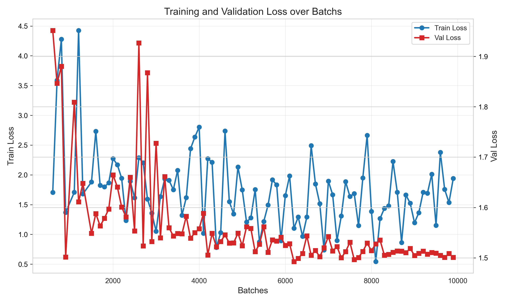

# RateMeAI
[](https://github.com/Pop101/RateMeAI/issues)

# Table of Contents
- [RateMeAI](#ratemeai)
- [Table of Contents](#table-of-contents)
- [Overview](#overview)
- [Technologies](#technologies)
- [Methodology](#methodology)
  - [Data Collection Methodology](#data-collection-methodology)
  - [Results and Evaluation](#results-and-evaluation)
  - [Ethics](#ethics)
- [Getting Started](#getting-started)
  - [Installation](#installation)
  - [Training](#training)
  - [Usage](#usage)

# Overview

We present RateMeAI, a novel facial evaluation tool that leverages data from the r/truerateme community to construct a neural network capable of quantitatively assessing facial attractiveness. Using a convolutional neural network architecture based on EfficientNet-B5, our model demonstrates promising performance with acceptable error margins on validation data.

# Technologies
This project is created with:
- [PyTorch](https://pytorch.org/): 2.6.0
- [Torchvision](https://pytorch.org/vision/stable/index.html): 0.21.0
- [EfficientNet-PyTorch](https://github.com/lukemelas/EfficientNet-PyTorch): 0.7.1
- [Polars](https://pola.rs/): 1.27.1
- [Pillow](https://python-pillow.github.io/): 11.2.1
- [Zstandard](https://github.com/indygreg/python-zstandard): 0.23.0
- [Requests](https://requests.readthedocs.io/): 2.32.3
- [tqdm](https://github.com/tqdm/tqdm): 4.67.1

# Methodology

The r/truerateme community is an online forum dedicated to amateur phrenology through facial attractiveness assessment using a semi-standardized, semi-questionable rating scale. This community prides itself on maintaining an average rating of 5.0, deliberately positioning average attractiveness at the midpoint of their scale. They maintain this strict rating guidelines supported by reference images to promote consistency and objective evaluation across assessments.

## Data Collection Methodology
To develop our dataset, we implemented a systematic approach for extracting numerical ratings from community comments. Our algorithm parsed all numerical values between 0-10 from comment text across all available threads. These ratings were then aggregated, with each rating weighted according to the relative score of its source comment within the thread context.


It is important to acknowledge certain methodological limitations in our data collection process. Notably, textual comments frequently contain numerical values that do not represent attractiveness ratings (e.g., "Others have rating him a 4 but I think he's a 5"). Despite this challenge, our weighting system appears to mitigate noise effectively by privileging higher-scoring comments that typically contain more accurate assessments.

The foundation of our model is EfficientNet-B5, a convolutional neural network architecture recognized for its exceptional performance-to-parameter ratio in image classification tasks. This architecture employs compound scaling to optimize depth, width, and resolution dimensions simultaneously.


Our training protocol consisted of 25,000 batches with implementation of learning rate reduction on performance plateau. To enhance model generalization, we employed batch shuffling at each epoch boundary. This methodology facilitated efficient convergence while mitigating overfitting risk.



## Results and Evaluation

The trained model demonstrates decent performance metrics, achieving a mean absolute error of 1.01 on our validation dataset. This indicates that, on average, the model's predicted attractiveness ratings deviate by approximately 1.01 points from human consensus ratings, which is close to the average human standard deviation of ratings (0.923).

## Ethics

This project is ripe for abuse. Please don't.

# Getting Started

## Installation
Clone the repository and ensure poetry is installed
```sh
git clone https://github.com/Pop101/RateMeAI
pip install poetry
```

Install the dependencies using poetry's version management
```sh
poetry install
```

## Training
Before traing the model, you need to download the required data. The data is not included in the repository due to its size and licensing issues. You can download the data from the following link:

1. Download the necessary data:
```sh
poetry run python download_data.py
```

2. Train the model:
```sh
poetry run python train_model.py
```

This will start the training process using the downloaded data. The model will be saved in the `model` directory after training.

## Usage
After setting up the project, you can use the trained model to evaluate images. 

```python
# Example usage (to be updated as the project develops)
from ratemeai import evaluate_image

score = evaluate_image("path/to/your/image.jpg")
print(f"Image score: {score}")
```